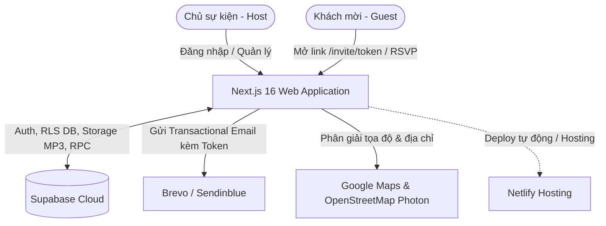

# 📖 HƯỚNG DẪN DÀNH CHO THÀNH VIÊN MỚI (PROJECT ONBOARDING)
## Dự án: E-Invitation MVP (Hệ thống Thiệp mời Điện tử & Quản lý RSVP)

Chào mừng bạn gia nhập đội ngũ phát triển dự án **E-Invitation**!  
Tài liệu này được biên soạn nhằm giúp bạn nhanh chóng nắm bắt bức tranh toàn cảnh, kiến trúc công nghệ, các dịch vụ liên kết, cấu trúc module, cách thiết lập môi trường, tài khoản test và quy trình kiểm thử/phát triển.

---

## 📌 MỤC LỤC
1. [Tổng quan dự án & Triết lý sản phẩm](#1-tổng-quan-dự-án--triết-lý-sản-phẩm)
2. [Các nền tảng dịch vụ liên kết (Integrations)](#2-các-nền-tảng-dịch-vụ-liên-kết-integrations)
3. [Hướng dẫn cài đặt & Cách chạy dự án Local](#3-hướng-dẫn-cài-đặt--cách-chạy-dự-án-local)
4. [Tài khoản đăng nhập, Mật khẩu & Quản lý người dùng](#4-tài-khoản-đăng-nhập-mật-khẩu--quản-lý-người-dùng)
5. [Hướng dẫn chạy Test & Kiểm tra chất lượng](#5-hướng-dẫn-chạy-test--kiểm-tra-chất-lượng)
6. [Chi tiết các trang giao diện & Luồng người dùng (Routes Map)](#6-chi-tiết-các-trang-giao-diện--luồng-người-dùng-routes-map)
7. [Cấu trúc thư mục & Phân chia Module (Codebase Modules)](#7-cấu-trúc-thư-mục--phân-chia-module-codebase-modules)
8. [Quy tắc phát triển & Những lưu ý quan trọng (Gotchas)](#8-quy-tắc-phát-triển--những-lưu-ý-quan-trọng-gotchas)

---

## 1. TỔNG QUAN DỰ ÁN & TRIẾT LÝ SẢN PHẨM

### 1.1. Mục đích của dự án
**E-Invitation** là nền tảng thiệp mời điện tử hiện đại, cá nhân hóa cao cấp dành cho các sự kiện (Đám cưới, Lễ tốt nghiệp, Tiệc kỷ niệm, Sinh nhật,...). 
Dự án giải quyết 2 bài toán cốt lõi:
1. **Dành cho Chủ sự kiện (Host):** Một bảng điều khiển (Dashboard) tinh gọn để chỉnh sửa thông tin sự kiện, tải nhạc nền, nhập danh sách khách mời, gửi email thiệp mời cá nhân hóa và theo dõi phản hồi tham dự (RSVP) tức thì.
2. **Dành cho Khách mời (Guest):** Nhận email có liên kết riêng biệt chứa token bảo mật. Mở ra một trải nghiệm phong bì thư hoạt họa (Invitation Entrance), mở thư tay cá nhân hóa, khám phá thiệp mời với âm nhạc, hiệu ứng và xác nhận tham dự (RSVP) **chính xác 1 lần duy nhất**.

### 1.2. Môi trường triển khai thực tế (Production)
- **Production URL:** [https://nc-thiepmoi.netlify.app](https://nc-thiepmoi.netlify.app)
- **Đăng nhập Host:** [https://nc-thiepmoi.netlify.app/login](https://nc-thiepmoi.netlify.app/login)

### 1.3. Các nguyên tắc sản phẩm quan trọng (Product Rules)
- **Không đăng ký tự do (No Public Sign-up):** Tài khoản Host và Sự kiện do Developer/Admin cấp trước từ backend. Không có form đăng ký mở trên website.
- **RSVP một lần (Idempotent 1-time RSVP):** Khách mời sau khi bấm xác nhận "Tôi sẽ tham gia" hoặc "Tôi không tham gia" sẽ được hệ thống khóa cứng vĩnh viễn. Mở lại link trên bất kỳ thiết bị nào chỉ thấy trạng thái đã gửi kèm lời cảm ơn, không thể sửa lại.
- **Bảo mật tuyệt đối đường dẫn khách:** Token của khách mời là chuỗi ngẫu nhiên mã hóa 64 ký tự hex. Không dùng ID tuần tự, không để lộ dữ liệu sự kiện ra ngoài phạm vi cho phép.
- **Không dùng CDN bên ngoài cho font và icons:** Toàn bộ font và icons được bundle trực tiếp vào source code (`@fontsource/*`) để đảm bảo không bị lỗi chặn mạng hoặc giảm tốc độ tải trang.

---

## 2. CÁC NỀN TẢNG DỊCH VỤ LIÊN KẾT (INTEGRATIONS)

Dự án tận dụng các dịch vụ Cloud hàng đầu để tối ưu hạ tầng:



### 2.1. Supabase (Backend as a Service)
- **Authentication:** Quản lý tài khoản đăng nhập của Host (Email + Password). Bảng `profiles` liên kết với `auth.users` kiểm tra quyền `role = 'host'` và `lifecycle_status = 'active'`.
- **PostgreSQL Database:** Lưu trữ toàn bộ dữ liệu sự kiện (`events`), danh sách thiệp mời (`invitations`), nhật ký gửi email (`email_send_attempts`), giới hạn gửi (`daily_email_counters`), slot nghe nhạc (`audio_request_slots`).
- **Row Level Security (RLS) & RPC Functions:** Bảo mật dữ liệu ở tầng cơ sở dữ liệu. Ví dụ: RPC `submit_rsvp_once` đảm bảo không bị race condition khi khách nhấn phản hồi.
- **Storage Bucket (`event-audio`):** Bucket lưu trữ file nhạc nền MP3 ở chế độ **Private**. Server tạo Signed URL có thời hạn ngắn (TTL 300 giây) khi Host hoặc Guest nghe nhạc.
- **Project Test ID:** Pinned tại `https://fbhfcsvvpacwfxpyntyx.supabase.co` (được ghi nhận trong `supabase/test-project.json`).

### 2.2. Brevo (Sendinblue - Dịch vụ gửi Email)
- **Transactional Email API:** Gửi email mời đích danh qua endpoint `POST https://api.brevo.com/v3/smtp/email`.
- **Verified Sender:** Email gửi được xác thực từ domain/email của dự án (`nguyennguyenchi714@gmail.com` - tên hiển thị: `ThuMoi`).
- **Hợp đồng gửi email (`docs/BREVO_SEND_CONTRACT.md`):**
  - Giới hạn cứng nội bộ: Tối đa 300 lượt gửi/ngày (giờ Việt Nam).
  - Sử dụng bảng **Ledger** (`email_send_attempts`) để chống gửi trùng lặp.
  - Xử lý trạng thái `unknown` (khi mạng lag hoặc phản hồi không rõ ràng): Hệ thống **khóa nút gửi lại**, không tự ý spam email sang Brevo mà yêu cầu kiểm tra đối soát thủ công trên dashboard Brevo.

### 2.3. Netlify (Hosting Platform)
- Chạy SSR Next.js App Router, quản lý biến môi trường an toàn tại production context.

### 2.4. OpenStreetMap / Photon & Google Maps
- File `src/features/events/map-resolver.ts`: Tự động phân tích các liên kết Google Maps do Host nhập (kể cả link rút gọn `maps.app.goo.gl` hay link tìm kiếm địa điểm), giải mã tọa độ và truy vấn Photon API để điền tự động tên địa điểm, địa chỉ chuẩn hóa tại Việt Nam.

---

## 3. HƯỚNG DẪN CÀI ĐẶT & CÁCH CHẠY DỰ ÁN LOCAL

### 3.1. Yêu cầu môi trường
- **Node.js:** Phiên bản `>= 22.0.0` (Bắt buộc theo cấu hình `package.json`).
- **npm:** Đi kèm với Node.js.
- **Git:** Đã cấu hình trên máy.

### 3.2. Các bước cài đặt chi tiết

1. **Clone repository và cài đặt thư viện:**
   ```bash
   git clone <URL_REPOSITORY>
   cd e-invitatio-main
   npm ci
   ```

2. **Cấu hình biến môi trường (`.env.local`):**
   Copy từ file mẫu:
   ```bash
   # Trên Windows PowerShell:
   Copy-Item .env.example .env.local

   # Hoặc trên Bash/macOS/Linux:
   cp .env.example .env.local
   ```

3. **Ý nghĩa các biến môi trường trong `.env.local`:**
   | Biến môi trường | Ý nghĩa | Mẫu / Ghi chú |
   | :--- | :--- | :--- |
   | `NEXT_PUBLIC_SUPABASE_URL` | URL kết nối dự án Supabase | `https://fbhfcsvvpacwfxpyntyx.supabase.co` |
   | `NEXT_PUBLIC_SUPABASE_ANON_KEY` | Public Anon Key của Supabase | Khóa công khai (an toàn cho phía client) |
   | `SUPABASE_SERVICE_ROLE_KEY` | Secret Service Role Key của Supabase | **Bảo mật tuyệt đối**, chỉ chạy phía server, bypass RLS khi cần |
   | `BREVO_API_KEY` | API Key của dịch vụ Brevo | Dùng để gửi email qua Brevo API v3 |
   | `BREVO_SENDER_EMAIL` | Email người gửi đã verify trên Brevo | `nguyennguyenchi714@gmail.com` |
   | `BREVO_SENDER_NAME` | Tên hiển thị người gửi | `ThuMoi` |
   | `SITE_URL` | Domain chính thức dùng để sinh link `/invite/{token}` | Chạy test deploy: `https://nc-thiepmoi.netlify.app`. *(Lưu ý: Không có dấu gạch chéo cuối, không có cổng)* |
   | `SUPABASE_TARGET` | Mục tiêu Supabase ghim | Phải đặt là `test` để khớp với `supabase/test-project.json` |
   | `EMAIL_TRANSPORT` | Cơ chế gửi email | Đặt là `brevo` (hoặc để trống) để gửi thật; đặt `stub` khi test local không gửi email ra ngoài |

4. **Khởi động server phát triển (Development):**
   ```bash
   npm run dev
   ```
   Mở trình duyệt truy cập: [http://localhost:3000](http://localhost:3000).

5. **Build và kiểm tra trước khi deploy:**
   ```bash
   # Kiểm tra biến môi trường và tính hợp lệ trước khi deploy:
   npm run check:deploy

   # Kiểm tra kiểu dữ liệu TypeScript:
   npm run typecheck

   # Đóng gói sản phẩm:
   npm run build
   ```

---

## 4. TÀI KHOẢN ĐĂNG NHẬP, MẬT KHẨU & QUẢN LÝ NGƯỜI DÙNG

### 4.1. Tài khoản Host Test có sẵn
Hệ thống đã có sẵn 1 tài khoản Host dùng để kiểm thử tính năng:
- **Email:** `hosta@test.com`
- **Mật khẩu:** Được quản trị viên cấp qua kênh nội bộ riêng (hoặc bạn có thể tự đặt lại trong Supabase Authentication Console theo mục 4.2 dưới đây).
- **Sự kiện mẫu gắn kèm:** Sự kiện `Lễ Tốt Nghiệp` (ngày 18/10/2026 tại Đại học Cần Thơ — Khu II, đường 3/2, phường Ninh Kiều, Cần Thơ).

### 4.2. Cách tạo tài khoản Host mới cho khách hàng (Dành cho Admin/Developer)
Vì hệ thống **không cho đăng ký tự do**, quy trình tạo tài khoản khách hàng mới diễn ra như sau. Trước khi gán `template_key` hoặc nhận khách thứ hai, làm theo `docs/QUY_TRINH_TRIEN_KHAI_KHACH_HANG.md`. Không gán khách mới vào `wedding-floral-01` hoặc `graduation-floral-01`: hai key này đang dùng chung một component và `content.ts`.

#### Bước 1: Tạo User trên Supabase Authentication
1. Mở trang quản trị Supabase -> Chọn dự án -> Mục **Authentication** -> **Users**.
2. Bấm **Add user** -> Chọn **Create user**.
3. Nhập Email (ví dụ: `khachhang@example.com`) và Mật khẩu bạn tự đặt. Chọn xác nhận email (Auto-confirm).
4. Bấm tạo và copy mã `User UID` (UUID dạng `xxxxxxxx-xxxx-xxxx-xxxx-xxxxxxxxxxxx`).
5. Khi user được tạo, database trigger `on_auth_user_created` sẽ tự động tạo 1 bản ghi tương ứng trong bảng `public.profiles` với `role = 'host'` và `lifecycle_status = 'active'`.

#### Bước 2: Tạo Sự kiện (Event) cho Host đó
Mở mục **SQL Editor** trên Supabase và chạy câu lệnh sau (thay thế UID vừa copy). `template_key` phải là key đã có trong bản production, theo `docs/QUY_TRINH_TRIEN_KHAI_KHACH_HANG.md`. Ví dụ dưới đây chỉ minh họa cú pháp; đừng dùng `wedding-floral-01` cho khách mới.

```sql
INSERT INTO public.events (
  user_id,
  title,
  template_key,
  event_date,
  venue_name,
  venue_address,
  google_map_url
) VALUES (
  'DIEN_USER_UID_VAO_DAY',
  'Lễ tốt nghiệp Nguyễn Mai Hoa',
  'graduation-hoa-mai',
  '2026-10-18T08:00:00+07:00',
  'Đại học Cần Thơ — Khu II',
  'Đường 3/2, Ninh Kiều, Cần Thơ',
  'https://maps.app.goo.gl/example'
);
```

#### Bước 3: Bàn giao cho Host
- Gửi đường link đăng nhập: `https://nc-thiepmoi.netlify.app/login`
- Gửi Email và Mật khẩu qua kênh nhắn tin riêng.

---

## 5. HƯỚNG DẪN CHẠY TEST & KIỂM TRA CHẤT LƯỢNG

Dự án trang bị bộ test tự động toàn diện từ unit test logic cho đến browser e2e test và smoke test production.

### 5.1. Chạy Typecheck (TypeScript)
Đảm bảo toàn bộ code không có lỗi type:
```bash
npm run typecheck
```

### 5.2. Chạy Unit Tests (`node:test`)
Chạy trực tiếp bộ test tích hợp không phụ thuộc thư viện ngoài:
```bash
node --test tests/*.test.mjs
```
Bộ test gồm có:
- **`tests/invitation-entrance.test.mjs`**: Kiểm tra máy trạng thái (State machine) của phong bì thư (`closed` -> `opening` -> `opened` -> `leaving` -> `invitation`), kiểm tra logic ghi nhớ lần mở (`hasViewedInvitation`), kiểm tra tính năng xem lại phong thư (`replay`).
- **`tests/map-resolver.test.mjs`**: Kiểm tra thuật toán phân tích Google Maps URL, mở rộng link rút gọn, trích xuất tọa độ, chuẩn hóa địa chỉ Việt Nam.

### 5.3. Chạy Browser E2E Test (Playwright)
Kiểm tra trực quan trải nghiệm người dùng, bố cục responsive và các tương tác mở thư trên trình duyệt Chromium thật:

```bash
# 1. Khởi động dev server ở terminal thứ nhất:
npm run dev

# 2. Chạy test browser ở terminal thứ hai:
node tests/invitation-entrance.browser.mjs
```
- Test sẽ tự động kiểm tra trên các kích thước màn hình: Mobile `320px`, `390px`, Tablet `768px`, Desktop `1440px`.
- Kiểm tra hỗ trợ phím bấm (Keyboard accessibility), chế độ giảm chuyển động (`prefers-reduced-motion`), âm thanh không tự ý phát khi chưa tương tác.
- Ảnh chụp màn hình kết quả sẽ được lưu tại thư mục `test-results/invitation-entrance/`.

### 5.4. Chạy Smoke Test kiểm tra Production (Chỉ đọc - An toàn)
Kiểm tra website đã deploy có đáp ứng các tiêu chuẩn bảo mật (không rò rỉ private key, header bảo mật `noindex`, `no-referrer`, trạng thái HTTP chính xác):

```powershell
# Trên PowerShell:
$env:SMOKE_BASE_URL = 'https://nc-thiepmoi.netlify.app'
npm run smoke:production
```

---

## 6. CHI TIẾT CÁC TRANG GIAO DIỆN & LUỒNG NGƯỜI DÙNG (ROUTES MAP)

Dưới đây là sơ đồ và chức năng cụ thể của từng trang trong ứng dụng:

| Đường dẫn (Route) | Quyền truy cập | Mục đích & Chức năng chính |
| :--- | :--- | :--- |
| `/` | Công khai | **Trang chuyển hướng:** Tự động kiểm tra session: chuyển sang `/dashboard` nếu đã đăng nhập, ngược lại sang `/login`. |
| `/login` | Công khai | **Đăng nhập Host:** Nhập Email & Mật khẩu. Hỗ trợ hiển thị/ẩn mật khẩu, duy trì phiên làm việc qua HTTP-only cookies của Supabase SSR. |
| `/dashboard` | Cần quyền Host | **Trung tâm quản trị sự kiện:** Gồm 3 Tab chức năng (xem mục 6.1 bên dưới). |
| `/preview` | Host hoặc Dev | **Xem trước thiệp mời:** Hiển thị giao diện thiệp với dữ liệu sự kiện thật và tên khách mời mẫu (hỗ trợ param `?guestName=...`). Form RSVP bị vô hiệu hóa để bảo đảm an toàn. |
| `/invite/[token]` | Khách mời (Token hợp lệ) | **Trải nghiệm thiệp mời của khách:** Phong bì hoạt họa mở thư -> Thiệp mời chi tiết -> Nghe nhạc nền -> Xác nhận RSVP 1 lần (xem mục 6.2 bên dưới). |

---

### 6.1. Giao diện Host Dashboard (`/dashboard`)
Dashboard chia làm 3 Tab chuyên biệt:
1. **Tab "Thiệp & thông tin":**
   - Chỉnh sửa: Tiêu đề sự kiện, ngày & giờ (múi giờ cố định `Asia/Ho_Chi_Minh`), tên địa điểm, địa chỉ, link Google Maps.
   - Nút **Lưu thay đổi**: Tự động đồng bộ và phân giải địa điểm bản đồ.
   - Tải nhạc nền MP3: Hỗ trợ tệp MP3 tối đa 10 MiB, lưu vào Supabase Private Storage, có nút **Nghe thử** trực tiếp.
   - Nút **Xem trước thiệp**: Mở modal / tab mới xem thiệp thực tế.
2. **Tab "Khách mời":**
   - Form thêm khách: Nhập Tên khách mời, Email, Lời nhắn riêng cá nhân hóa (tối đa 500 ký tự).
   - Nút **Gửi lời mời**: Lưu vào cơ sở dữ liệu và gọi API Brevo gửi email chứa liên kết token riêng.
   - Bảng danh sách khách mời: Hiển thị tên, email, trạng thái gửi email (`Chưa gửi`, `Đang gửi`, `Đã tiếp nhận`, `Thất bại`, `Chưa rõ kết quả`).
   - Nút **Gửi lại**: Cho phép gửi lại email mời (chỉ hoạt động khi kết quả không bị rơi vào trạng thái `unknown`).
3. **Tab "Phản hồi":**
   - Khối thống kê: Tổng số khách, Số lượng chưa phản hồi, Số lượng đồng ý tham gia, Số lượng từ chối.
   - Bảng danh sách phản hồi: Hiển thị chi tiết khách mời, trạng thái RSVP, lời chúc/ghi chú của khách, thời gian phản hồi.
   - Cơ chế tự động Polling: Bảng tự động cập nhật dữ liệu mới định kỳ khi Host đang mở trang mà không cần F5.

---

### 6.2. Giao diện Khách mời (`/invite/[token]`)
Luồng trải nghiệm được tối ưu tỉ mỉ qua 4 giai đoạn chuyển cảnh mượt mà:

```text
[1. Phong bì đóng kín] ──(Bấm "Mở thư")──> [2. Phong thư mở & Thư tay cá nhân]
                                                      │
                                             (Bấm "Xem thư mời")
                                                      │
                                                      ▼
[4. Màn hình Cảm ơn & Khóa RSVP] <──(Gửi RSVP)─── [3. Toàn bộ Thiệp mời chính]
  (Mở lại sau này chỉ xem kết quả)                   (Nhạc nền, Countdown, Map, Form RSVP)
```

1. **Giai đoạn 1 - Phong bì đóng kín (Stage: `closed`):**
   - Hiển thị chiếc phong bì thư sang trọng. Bên ngoài in trang trọng dòng chữ: *"Thư mời gửi đến: [Tên khách mời]"*.
2. **Giai đoạn 2 - Mở thư & Thư tay (Stage: `opened`):**
   - Khách bấm **"Mở thư"**, nắp phong bì mở ra và lá thư tay trượt lên nhẹ nhàng.
   - Hiển thị lời tựa riêng hoặc lời chúc mà Host đã viết riêng cho khách mời này.
3. **Giai đoạn 3 - Thiệp mời chi tiết (Stage: `invitation`):**
   - Khách bấm **"Xem thư mời"**, màn hình chuyển vào giao diện thiệp hoàn chỉnh.
   - Thanh điều khiển nhạc nền: Khách có thể phát/tạm dừng nhạc.
   - Đồng hồ đếm ngược (Countdown) tới giờ diễn ra sự kiện.
   - Thông tin sự kiện: Tên lễ, ngày giờ, địa điểm kèm nút mở Google Maps chỉ đường.
   - Nút *"Xem lại phong thư"*: Cho phép khách xem lại hoạt họa mở thư bất kỳ lúc nào mà không làm mất nội dung đang điền.
4. **Giai đoạn 4 - Form RSVP & Khóa phản hồi:**
   - 2 lựa chọn rõ ràng: **"Tôi sẽ tham gia"** hoặc **"Tôi không tham gia"**.
   - Ô nhập lời nhắn / lời chúc mừng gửi đến gia chủ.
   - Bấm **"Gửi xác nhận"**: Gọi RPC `submit_rsvp_once` trên Supabase. Sau khi lưu thành công, giao diện chuyển sang màn hình Cảm ơn (**ResponseReceipt**).
   - **Cơ chế khóa:** Kể từ thời điểm này, token của khách đã ghi nhận `rsvp_status`. Khách mở lại link sẽ thấy ngay màn hình cảm ơn kèm lựa chọn của mình, form RSVP không còn hiển thị nữa.

---

## 7. CẤU TRÚC THƯ MỤC & PHÂN CHIA MODULE (CODEBASE MODULES)

Source code được tổ chức theo kiến trúc **Feature-driven** rõ ràng và dễ mở rộng:

```
e-invitatio-main/
├── docs/                                # Tài liệu kỹ thuật chuyên sâu
│   ├── BREVO_SEND_CONTRACT.md          # Hợp đồng gửi email Brevo & đối soát trạng thái
│   └── HUONG_DAN_TAO_THIEP_MOI.md      # Quy trình tạo thiệp mới & thêm giao diện
├── public/                              # Tài nguyên tĩnh
│   ├── fonts/                          # Các font chữ đã được bundle cục bộ
│   └── templates/                      # Ảnh trang trí cho các mẫu thiệp
├── scripts/                             # Scripts kiểm tra và hỗ trợ build
│   ├── check-deploy.mjs                # Kiểm tra biến môi trường trước khi deploy
│   ├── prepare-template-assets.mjs     # Đồng bộ ảnh và font template
│   └── verify-production.mjs           # Smoke test kiểm tra bảo mật production
├── src/
│   ├── app/                            # Next.js 16 App Router
│   │   ├── api/                        # API routes
│   │   │   ├── auth/                   # POST /api/auth/login, POST /api/auth/logout
│   │   │   ├── host/                   # API quản lý sự kiện, khách mời, nhạc, địa điểm
│   │   │   └── guest/                  # API đọc thiệp mời, lấy signed URL nhạc, gửi RSVP
│   │   ├── dashboard/                  # Giao diện Host Dashboard
│   │   ├── invite/[token]/             # Giao diện Khách mời
│   │   ├── login/                      # Giao diện Đăng nhập Host
│   │   ├── preview/                    # Giao diện Xem trước thiệp
│   │   ├── layout.tsx                  # Root layout
│   │   └── page.tsx                    # Route gốc (Redirect thông minh)
│   ├── features/                       # Các module tính năng độc lập
│   │   ├── auth/                       # Đăng nhập, session server, đăng xuất
│   │   ├── email/                      # Tích hợp Brevo, render email, email ledger
│   │   ├── events/                     # Quản lý sự kiện, upload nhạc, phân giải bản đồ
│   │   ├── guest/                      # Hoạt họa phong thư, form RSVP, receipt
│   │   ├── invitations/                # Quản lý danh sách khách mời, gửi thư
│   │   ├── responses/                  # Bảng theo dõi RSVP, polling dữ liệu
│   │   └── template/                   # Multi-Template registry & các mẫu thiệp
│   └── lib/                            # Cấu hình dùng chung
│       ├── contracts.ts                # Định nghĩa kiểu dữ liệu & schema hợp đồng
│       ├── validation.ts               # Bộ validator dữ liệu đầu vào
│       └── supabase/                   # Khởi tạo Supabase client (browser, server, admin)
├── supabase/
│   ├── migrations/                     # Các file migration SQL (schema, RLS, triggers)
│   └── test-project.json               # Ghim ID project Supabase test an toàn
└── tests/                              # Bộ kiểm thử tự động
    ├── invitation-entrance.browser.mjs # E2E Browser test với Playwright
    ├── invitation-entrance.test.mjs    # Unit test State machine phong thư
    └── map-resolver.test.mjs           # Unit test bộ phân giải Google Maps
```

### 7.1. Cách thêm một Mẫu thiệp mới (Multi-Template)
Hệ thống hỗ trợ nhiều mẫu thiệp khác nhau thông qua **Template Registry**:
1. Tạo component mẫu trong `src/features/template/templates/` (ví dụ `BirthdayVip01.tsx`).
2. Định nghĩa giao diện tuân theo `TemplateProps`.
3. Đăng ký mã template mới trong `src/features/template/registry.ts` và `src/features/template/resolve-key.ts`.
4. Khi tạo sự kiện cho Host, chỉ cần truyền `template_key = 'birthday-vip-01'`.

---

## 8. QUY TẮC PHÁT TRIỂN & NHỮNG LƯU Ý QUAN TRỌNG (GOTCHAS)

Để giữ cho codebase luôn sạch sẽ, bảo mật và ổn định, hãy luôn ghi nhớ các quy tắc sau:

> [!CAUTION]
> ### 1. Bảo mật khóa bí mật & Biến môi trường
> - **KHÔNG BAO GIỜ** commit file `.env.local` hoặc bất kỳ khóa API nào (`SUPABASE_SERVICE_ROLE_KEY`, `BREVO_API_KEY`) lên Git repository.
> - Client components chỉ được phép tiếp cận `NEXT_PUBLIC_*`. Tất cả các thao tác nhạy cảm (gửi email, duyệt database bằng service role, xử lý audio) **bắt buộc chạy tại Server-side** (dùng `import 'server-only'`).

> [!IMPORTANT]
> ### 2. Quy tắc về Cơ sở dữ liệu & Migration
> - Không tự ý vào Supabase dashboard bấm sửa bảng trực tiếp mà không lưu lại code.
> - Mọi thay đổi về cấu trúc bảng, RLS hoặc hàm Stored Procedure phải được tạo thành file SQL mới trong `supabase/migrations/` với định dạng tên `YYYYMMDD000X_ten_migration.sql`.
> - Chú ý `supabase/test-project.json` ghim đúng project test để tránh việc chạy nhầm script vào môi trường khác.

> [!WARNING]
> ### 3. Quy tắc gửi Email qua Brevo
> - Khi gửi email, nếu phản hồi trả về lỗi mạng, timeout hoặc HTTP 500, trạng thái gửi sẽ được ghi nhận là `unknown`.
> - **Tuyệt đối không tự ý thêm hàm tự động gửi lại (auto-retry)** khi chưa có xác nhận từ Brevo log, vì điều này có thể làm khách mời nhận nhiều email trùng lặp gây khó chịu.

> [!TIP]
> ### 4. Lưu ý về Next.js 16 App Router
> - Next.js 16 có nhiều thay đổi và tối ưu hóa mới về caching, server actions và async params. Luôn tuân thủ cách viết bất đồng bộ hiện đại và kiểm tra bằng `npm run typecheck` trước khi push code.
> - Đảm bảo giữ khối cảnh báo trong file `AGENTS.md` sạch sẽ để tránh các xung đột git không đáng có khi chạy `next dev`.

---

Nếu bạn có bất kỳ câu hỏi nào trong quá trình làm việc, hãy thảo luận cùng team qua kênh trao đổi nội bộ hoặc tham khảo thêm các tài liệu chi tiết trong thư mục `docs/`. Chúc bạn có trải nghiệm lập trình thật hiệu quả cùng dự án E-Invitation! 🚀
